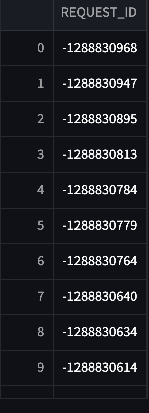
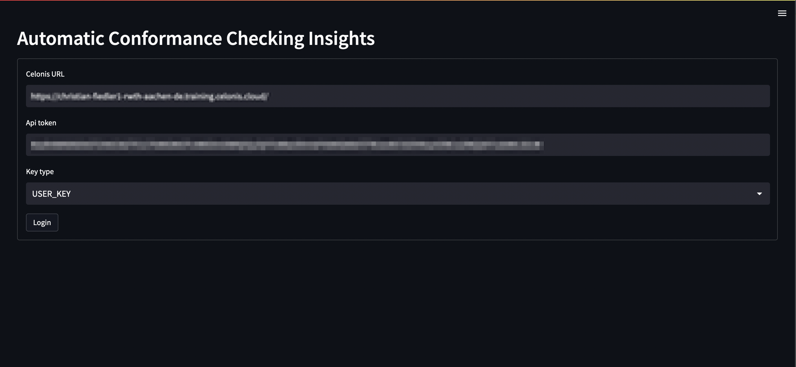
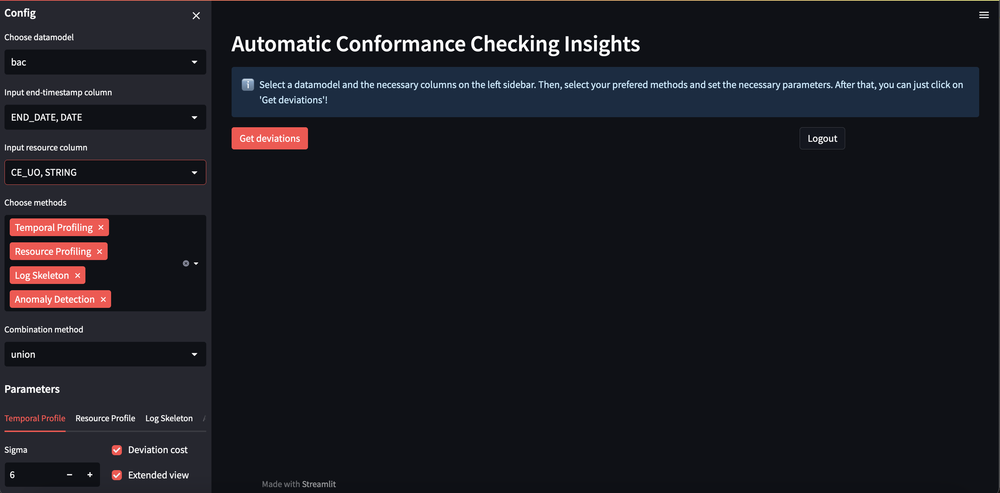
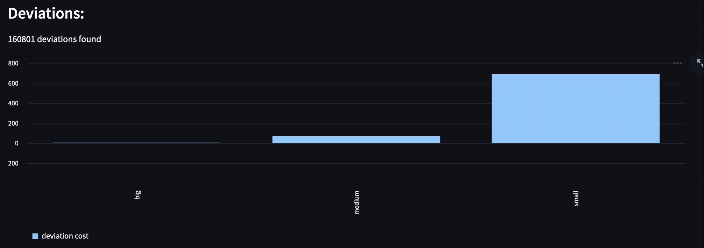
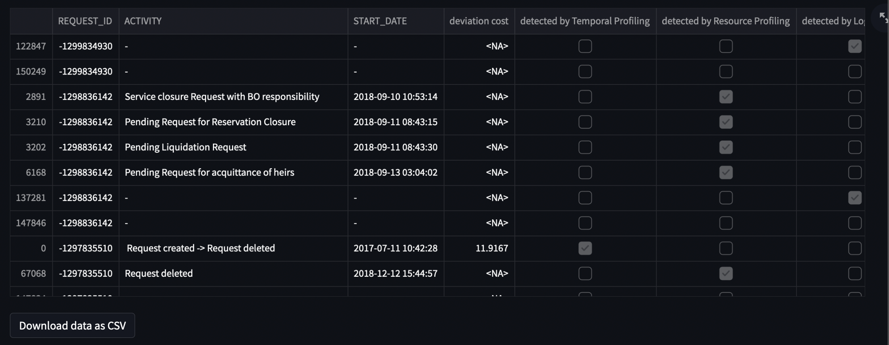

# Automatic-Conformance-Checking

We developed the library **pyinsights** to get automatic conformance checking insights on business processes.
We aim at a seamless integration with one of the leading process mining tools [Celonis](https://www.celonis.com/).

## Dependencies

- pm4py
- streamlit
- scikit-learn
- prince
- seaborn
- plotly

## Install

Just do

```sh
pip install --extra-index-url=https://pypi.celonis.cloud/ .
```

and pip will take care of the rest!

## Usage Examples

### Resource Profiling Example

Our library pyinsights can compute the resource profile of an event log and
identify deviating cases with batches based on it. We define the resource profile as the
number of times a resource executes an activity within a certain time-unit.
A batch then is when these numbers exceed a certain threshold. You can also group
the batches into types.

```python
    from pyinsights import Connector
    from pyinsights.organisational_profiling import ResourceProfiler
    celonis_url = <celonis_url>
    api_token = <celonis api token>

    # define connector and connect to celonis
    connector = Connector(api_token=api_token, url=celonis_url, key_type="USER_KEY")

    # choose data model
    print("Available datamodels:")
    print(connector.celonis.datamodels)
    print("Input id of datamodel:")
    id = input()
    connector.set_parameters(model_id=id, end_timestamp="END_DATE",
                            resource_column="CE_UO)

    # init resource profiler
    res_profiler = ResourceProfiler(connector=connector)

    # compute resource profile (not needed for next step)
    res_profile = res_profiler.resource_profile(time_unit="HOURS",
                                                reference_unit="DAY")

    # get cases with batches
    batches_df = res_profiler.cases_with_batches(time_unit="HOURS", reference_unit="DAY",
                                         min_batch_size=2, batch_percentage=0.1
                                    , grouped_by_batches=True, batch_types=True)
    batches_df
```

<p align="center">
  
</p>

You can also identify cases violating the four-eyes principle.

```python
    from pyinsights.organisational_profiling import segregation_of_duties

    activities = ['Pending Liquidation Request', 'Request completed with account closure']
    segregation_of_duties(connector=connector, resource_column="CE_UO", activities)
```

<p align="center">
  
</p>

### Temporal Profiling Example

Our library pyinsights can compute the temporal profile of an event log and
identify deviating cases based on it.

```python
    from pyinsights import Connector
    from pyinsights.temporal_profiling import TemporalProfiler

    celonis_url = <celonis_url>
    api_token = <celonis api token>

    # define connector and connect to celonis
    connector = Connector(api_token=api_token, url=celonis_url, key_type="USER_KEY")

    # choose data model
    print("Available datamodels:")
    print(connector.celonis.datamodels)
    print("Input id of datamodel:")
    id = input()
    connector.set_parameters(model_id=id, end_timestamp="END_DATE")

    # init temporal profiler
    temporal_profiler = TemporalProfiler(connector=connector)

    #compute temporal profile (not necessary for next steps)
    temporal_profile = temporal_profiler.temporal_profile()
    # compute deviating cases with deviation cost
    df_temporal_profile = temporal_profiler.deviating_cases(sigma = 6, extended_view=False)

    df_temporal_profile
```

<p align="center">
  
</p>

### Log Skeleton Example

Pyinsights can compute the log skeleton of a log.

````python
from pyinsights.log_skeleton import LogSkeleton

skeleton = LogSkeleton(connector)

# get lsk as pm4py-conforming dict
lsk_dict = skeleton.get_log_skeleton(noise_threshold=0)```
````

To use the log skeleton for conformance, use the following code

````python
from pyinsights.log_skeleton import LogSkeleton

skeleton = LogSkeleton(connector)

# get non conforming cases
df_log_skeleton = skeleton.get_non_conforming_cases(noise_threshold=0)

df_log_skeleton
````

This returns a data frame with the non conforming cases

<p align="center">
  
</p>

### Anomaly Detection Example

Pyinsights can identify anomalous cases based on IsolationForests.

```python
from pyinsights.ml import anomaly_detection

connector.set_parameters(model_id=id, end_timestamp="END_DATE")
anomaly_detection_df = anomaly_detection(connector=connector)

anomaly_detection_df
```

<p align="center">
  
</p>

### Combiner

Lastly, each method can be used in combination with all others.

```python
from pyinsights import Combiner

combiner = Combiner(connector=connector)

deviations = {"Log Skeleton":df_log_skeleton, 
              "Temporal Profile":df_temporal_profile,
              "Anomaly Detection":anomaly_detection_df
              }

df = combiner.combine_deviations(deviations=deviations, how="union")

df
```

## Web Frontend

The easiest way to interact with our library is to use the frontend, which we developed for it. To get started, run the following command in your Terminal:

```bash
streamlit run user_interface.py --theme.base "dark"
```

This will open the web interface in your browser

Login with your credentials

In the left tab, you can select your event log and select the end timestamp and resource column.
You can select which deviation method to select and how you want to combine the results.
You can also configure the parameters for each method.
On the main tab, you can now click on `Get deviations`.
This will run each method that you selected and combine the result into a single data frame. The results should look as follows. (Note that the deviation distribution will only show if you selected the Temporal Profiler)


You can also export the dataframe as `CSV` by clicking on `Download data as CSV`


## Citations

Pyinsights implements some approaches on conformance checking first suggested in research.
Some of the papers we used include:

- [Temporal Conformance Checking at Runtime based on Time-infused Process Models](https://arxiv.org/abs/2008.07262)
- [Log Skeletons: A Classification Approach to Process Discovery](https://arxiv.org/abs/1806.08247)

## Adjustments to Log Skeleton
During the implementation of the log skeleton according to the definition of the paper, we concluded that their approach is not computationally feasible as the runtime for determining all possible subsets that need to be checked is exponential.
The authors also acknowledge this fact in their paper.

Thus for our approach, we decided to take a simpler approach. For constructing the log skeleton, we use a `noise_threshold`. Instead of requiring that a particular relation holds for each trace, we require it to hold for `noise_treshold*case_count`.

For computing the deviations, we first calculate the relation for each trace individually. We say that a trace conforms, if there are less than `noise_threshold*case_count` of differences between the relation for the trace and the overall relation for all traces.
