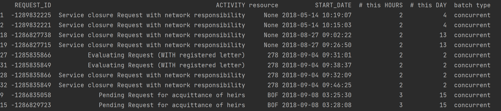
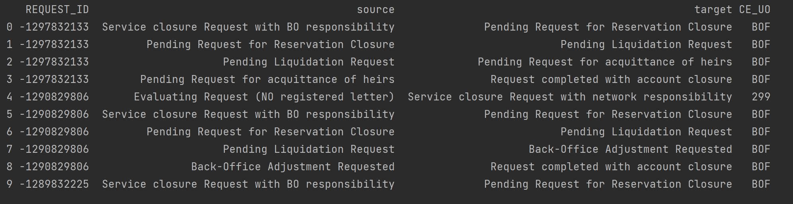
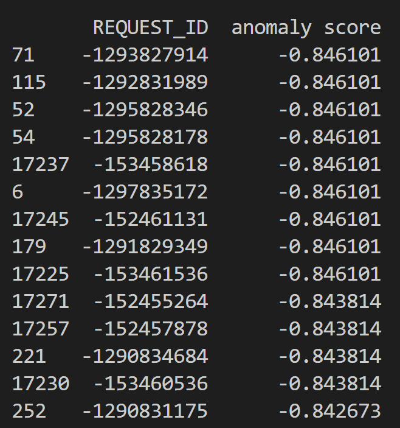

# Automatic-Conformance-Checking

We developed the library **pyinsights** to get automatic conformance checking insights on business processes.
We aim at a seamless integration with one of the leading process mining tools [Celonis](https://www.celonis.com/).

## Dependencies

- pm4py
- streamlit
- scikit-learn
- prince
- seaborn
- plotly

## Install
Just do
```sh
pip install --extra-index-url=https://pypi.celonis.cloud/ pycelonis=="1.7.3"
pip install .
```
and pip will take care of the rest!
## Usage Examples

### Resource Profiling Example

Our library pyinsights can compute the resource profile of an event log and
identify deviating cases with batches based on it. We define the resource profile as the
number of times a resource executes an activity within a certain time-unit.
A batch then is when these numbers exceed a certain threshold. You can also group
the batches into types.

```python
    from pyinsights import Connector
    from pyinsights.organisational_profiling import ResourceProfiler
    celonis_url = <celonis_url>
    api_token = <celonis api token>

    # define connector and connect to celonis
    connector = Connector(api_token=api_token, url=celonis_url, key_type="USER_KEY")

    # choose data model
    print("Available datamodels:")
    print(connector.celonis.datamodels)
    print("Input id of datamodel:")
    id = input()
    connector.set_parameters(model_id=id, end_timestamp="END_DATE",
                            resource_column="CE_UO)

    # init resource profiler
    res_profiler = ResourceProfiler(connector=connector)

    # compute resource profile (not needed for next step)
    res_profile = res_profiler.resource_profile(time_unit="HOURS",
                                                reference_unit="DAY")

    # get cases with batches
    batches_df = res_profiler.cases_with_batches(time_unit="HOURS", reference_unit="DAY",
                                         min_batch_size=2, batch_percentage=0.1
                                    , grouped_by_batches=True, batch_types=True)
    batches_df
```

<p align="center">
  
</p>

You can also identify cases violating the four-eyes principle.

```python
    from pyinsights.organisational_profiling import segregation_of_duties

    activities = ['Pending Liquidation Request', 'Request completed with account closure']
    segregation_of_duties(connector=connector, resource_column="CE_UO", activities)
```

<p align="center">
  
</p>

### Temporal Profiling Example

Our library pyinsights can compute the temporal profile of an event log and
identify deviating cases based on it.

```python
    from pyinsights import Connector
    from pyinsights.temporal_profiling import TemporalProfiler

    celonis_url = <celonis_url>
    api_token = <celonis api token>

    # define connector and connect to celonis
    connector = Connector(api_token=api_token, url=celonis_url, key_type="USER_KEY")

    # choose data model
    print("Available datamodels:")
    print(connector.celonis.datamodels)
    print("Input id of datamodel:")
    id = input()
    connector.set_parameters(model_id=id, end_timestamp="END_DATE")

    # init temporal profiler
    temporal_profiler = TemporalProfiler(connector=connector)

    #compute temporal profile (not necessary for next steps)
    temporal_profile = temporal_profiler.temporal_profile()
    # compute deviating cases with deviation cost
    deviating_cases_df = temporal_profiler.deviating_cases(sigma = 6, extended_view=False)
    deviating_cases_df
```

<p align="center">
  
</p>

### Log Skeleton Example

Pyinsights can compute the log skeleton of a log.

```python
from pyinsights.log_skeleton import LogSkeleton

skeleton = LogSkeleton(connector)

# get lsk as pm4py-conforming dict
lsk_dict = skeleton.get_log_skeleton(noise_threshold=0)```
```
### Anomaly Detection Example

Pyinsights can identify anomalous cases based on IsolationForests.

```python
from pyinsights.ml import anomaly_detection

connector.set_parameters(model_id=id, end_timestamp="END_DATE")
anomaly_detection(connector=connector)
```

<p align="center">
  
</p>

## Citations

Pyinsights implements some approaches on conformance checking first suggested in research.
Some of the paper we used include:

- [Temporal Conformance Checking at Runtime based on Time-infused Process Models](https://arxiv.org/abs/2008.07262)
- [Log Skeletons: A Classification Approach to Process Discovery](https://arxiv.org/abs/1806.08247)
