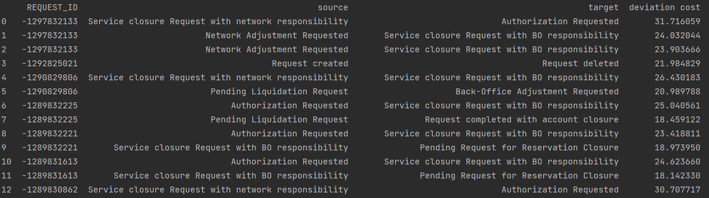

# Automatic-Conformance-Checking

We developed the library **pyinsights** to get automatic conformance checking insights on business processes. 
We aim at a seamless integration with one of the leading process mining tools [Celonis](https://www.celonis.com/).
## Dependencies
- numpy
- pandas
- pycelonis == 1.7.3
- pm4py == 2.2.23


## Install
- Install pycelonis

    ```sh
    pip install --extra-index-url=https://pypi.celonis.cloud/ pycelonis=="1.7.3"
    ```

- Install dotenv

    ```sh
    pip install python-dotenv
    ```

## `pyinsights is not a module`

This means you need to `/path/to/pyinsights-folder` to `PYTHONPATH` environment variable

## `packaging is not a module`

Pycelonis relies on this package but does not seem to install it, so we install it manually

```sh
pip install packaging
```
## Usage Examples
### Temporal Profiling Example
Our library pyinsights can compute the temporal profile of an event log and 
identify deviating cases based on it.
```python
    from pyinsights import Connector
    from pyinsights.temporal_profiling import TemporalProfiler

    celonis_url = <celonis_url>
    api_token = <celonis api token>

    # define connector and connect to celonis
    connector = Connector(api_token=api_token, url=celonis_url, key_type="USER_KEY")

    # choose data model
    print("Available datamodels:")
    print(connector.celonis.datamodels)
    print("Input id of datamodel:")
    id = input()
    connector.set_paramters(model_id=id)#, end_timestamp="END_DATE")

    # init temporal profiler
    temporal_profiler = TemporalProfiler(connector=connector)

    #compute temporal profile (not necessary for next steps)
    temporal_profile = temporal_profiler.temporal_profile()
    # compute deviating cases with deviation cost
    deviating_cases_df = temporal_profiler.deviating_cases(sigma = 6, extended_view=False)
    deviating_cases_df
```
<p align="center">
  
</p>


## Citations
Pyinsights implements some approaches on conformance checking first suggested in research.
Some of the paper we used include:
- [Temporal Conformance Checking at Runtime based on Time-infused Process Models](https://arxiv.org/abs/2008.07262)
